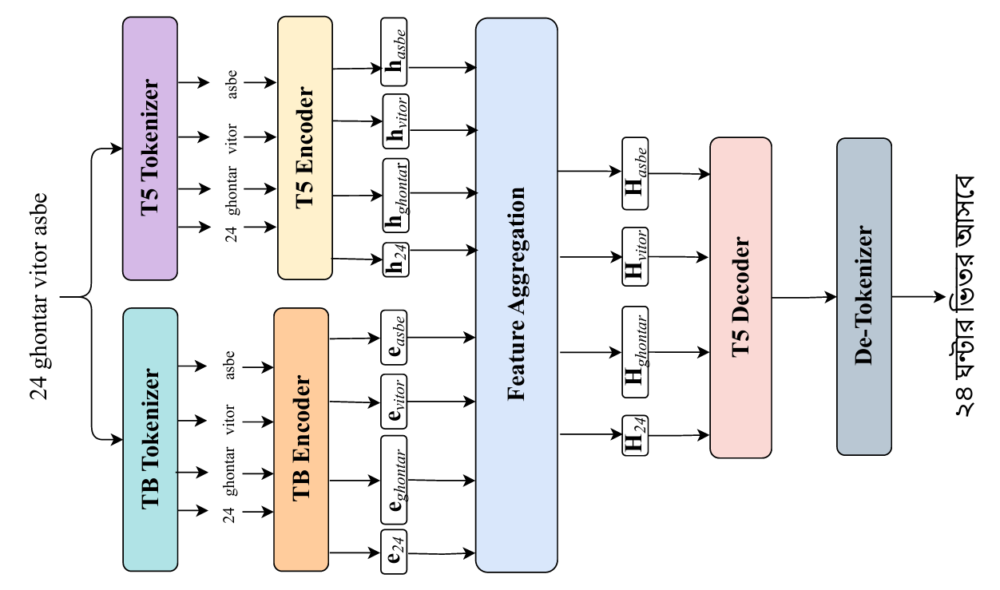

# BanglaTLit: A Benchmark Dataset for Back-Transliteration of Romanized Bangla

_Findings of the Association for Computational Linguistics: EMNLP 2024_

[Md Fahim*](https://github.com/md-fahim/), [Fariha Tanjim Shifat*](https://github.com/fariha6412), [Md Farhan Ishmam*](https://farhanishmam.github.io/), [Deeparghya Dutta Barua](https://github.com/arg274), 
[Fabiha Haider](https://github.com/FabihaHaider), [Md Sakib Ul Rahman Sourove](https://github.com/souroveskb), and [Farhad Alam Bhuiyan](https://github.com/pdfarhad).

## Dataset Overview

- **BanglaTLit-PT:** A pre-training corpus with 245727 transliterated or romanized Bangla samples for further pre-training language models.
- **BanglaTLit:** Subset of the BanglaTLit-PT dataset containing 42705 romanized Bangla and its corresponding Bangla back-transliteration pairs.
- Summary statistics of the BanglaTLit dataset are provided below. **TL**: Transliterated and **BTL**: Back-Transliterated.

   | Statistic              | TL    | BTL   |
   |-------------------------|-------|-------|
   | Mean Character Length    | 59.24 | 58.28 |
   | Max Character Length     | 1406  | 1347  |
   | Min Character Length     | 3     | 4     |
   | Mean Word Count          | 10.35 | 10.51 |
   | Max Word Count           | 212   | 226   |
   | Min Word Count           | 2     | 2     |
   | Unique Word Count        | 81848 | 60644 |
   | Unique Sentence Count    | 42705 | 42471 |

## Methodology Overview



Our proposed model architecture consists of a dual-encoder setup where the contextualized embeddings are aggregated and passed to the `T5` decoder. We use a `T5` encoder and a Transliterated Bangla `TB` encoder i.e. an encoder-based model that is further pre-trained on the BanglaTLit-PT corpus. Feature aggregation is done using summation and alternative strategies have been explored in the ablations.

## Quick Start

### [](https://colab.research.google.com/drive/1xZnQmbkOVZrMvZgDAhuTP62KQO2N6-vE?usp=sharing) Further Pre-training on Romanized Bangla Corpus
### [](https://colab.research.google.com/drive/1EpgVq58RZm1U9ep9FKqlqw2IAGu9eUNY?usp=sharing) Romanized Bangla Back-Transliteration 

## Installation

Create a virtual environment and install all the dependencies. Ensure that you have `Python 3.8` or higher installed.

```
pip install -r requirements.txt
```
## Further Pre-training (Optional)

If you wish to further pre-train the model on your specific dataset, you can do so by running the following script:

```
python scripts/further_pretraining.py
```
This step is optional as you can alternatively use the pre-trained model weights provided on HuggingFace.

## Further Pre-Trained (FPT) Model Weights

If you prefer not to further pre-train the model, you can directly use the pre-trained weights by downloading them from HuggingFace. Change the `model` in the configuration to the Hugging Face repository name.

| FPT Model     | Hugging Face Repo     |
|--------------|--------------|
| [](https://huggingface.co/aplycaebous/tb-BERT-fpt) | aplycaebous/tb-BERT-fpt |
| [](https://huggingface.co/aplycaebous/tb-mBERT-fpt) | aplycaebous/tb-mBERT-fpt |
| [](https://huggingface.co/aplycaebous/tb-XLM-R-fpt) | aplycaebous/tb-XLM-R-fpt |
| [](https://huggingface.co/aplycaebous/tb-BanglaBERT-fpt) | aplycaebous/tb-BanglaBERT-fpt |
| [](https://huggingface.co/aplycaebous/tb-BanglishBERT-fpt) | aplycaebous/tb-BanglishBERT-fpt |

## Training and Evaluation
   
To train and evaluate the model on Bangla back-transliteration, use the following command:

```
python scripts/training_back_transliteration.py
```

## Sample Testing

The trained model can be tested on a given sample by running the following command:

```
python scripts/inference_back_transliteration.py
```
